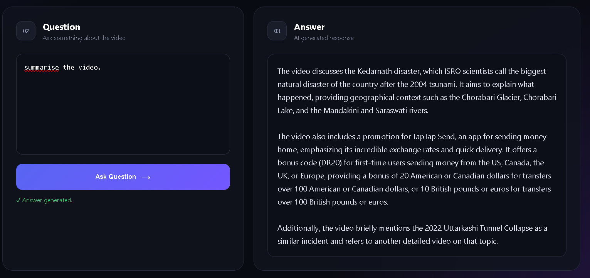
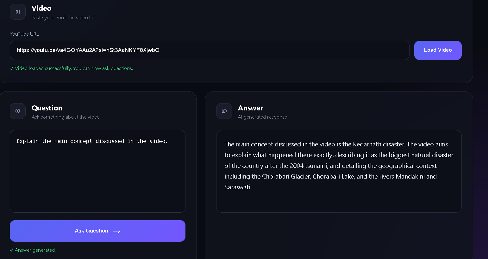
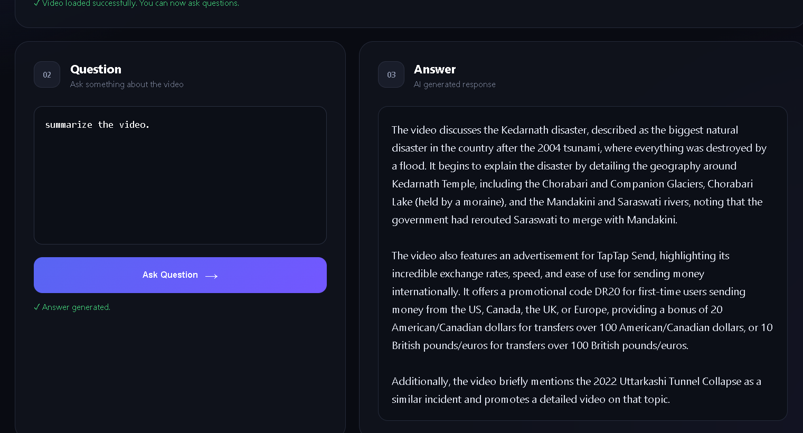

# 🎥 YouTube Video Q&A — RAG Application

A **Retrieval-Augmented Generation (RAG)** based YouTube Video Question Answering application built with **Python, Flask, LangChain, Gemini, FAISS, and YouTube Transcript API**.

The application fetches a YouTube video's transcript, splits it into smaller chunks, converts the chunks into vector embeddings, and stores them in FAISS. When a user asks a question, the application retrieves the most relevant transcript chunks and provides them as context to Gemini to generate an answer.

This allows users to ask questions about long YouTube videos and receive answers based on the video's transcript.

---

## 📸 Home Pages






---

## 🚀 Features

- 🔗 Enter a YouTube video URL
- 📝 Automatically fetch the video's transcript
- 🌍 Supports available transcripts/languages
- ✂️ Split transcripts into smaller chunks
- 🧠 Generate embeddings using Gemini
- 🔎 Semantic search using FAISS
- 🤖 Generate answers using Gemini 2.5 Flash
- 💬 Ask multiple questions about the loaded video
- 🎯 Generate answers based on the video transcript
- 🌐 Flask backend with a web-based frontend
- ⚡ Fast information retrieval using vector search

---

## 🛠️ Tech Stack

### Backend

- Python
- Flask
- Flask-CORS

### AI / LLM

- Google Gemini
- `gemini-2.5-flash`
- `gemini-embedding-001`

### RAG

- LangChain
- FAISS
- Recursive Character Text Splitter
- Vector Embeddings
- Semantic Search

### YouTube

- YouTube Transcript API

### Frontend

- HTML
- CSS
- JavaScript

---

## 🧠 How It Works

The application follows a **Retrieval-Augmented Generation (RAG)** architecture.

```text
YouTube URL
     ↓
Extract Video ID
     ↓
Fetch Transcript
     ↓
Split Transcript into Chunks
     ↓
Generate Embeddings
     ↓
Store Embeddings in FAISS
     ↓
User Asks Question
     ↓
Similarity Search
     ↓
Retrieve Relevant Transcript Chunks
     ↓
Send Retrieved Context + Question to Gemini
     ↓
Generate Answer
     ↓
Display Answer
```

### RAG Pipeline

The project follows three main stages:

**1. Retrieval**

Relevant transcript chunks are retrieved from the FAISS vector store based on the user's question.

**2. Augmentation**

The retrieved transcript chunks are added as context along with the user's question.

**3. Generation**

Gemini 2.5 Flash uses the retrieved context to generate the final answer.

---

## 📂 Project Structure

```text
youtube-video-qa/
│
├── app.py
│
├── frontend/
│   ├── index.html
│   ├── style.css
│   └── script.js
│
├── images/
│   ├── home1.png
│   ├── home2.png
│   └── home3.png
│
├── .env
├── .gitignore
├── requirements.txt
└── README.md
```

---

## ⚙️ Installation

### 1. Clone the Repository

```bash
git clone https://github.com/YOUR_USERNAME/youtube-video-qa.git
```

```bash
cd youtube-video-qa
```

### 2. Create a Virtual Environment

```bash
python -m venv venv
```

Activate it on Windows:

```bash
venv\Scripts\activate
```

### 3. Install Dependencies

```bash
pip install -r requirements.txt
```

---

## 🔑 API Key Setup

Create a `.env` file in the project directory:

```env
GOOGLE_API_KEY=your_google_api_key
```

Load the environment variable in Python:

```python
from dotenv import load_dotenv

load_dotenv()
```

**Never upload your API key to GitHub.**

Add the following to `.gitignore`:

```text
.env
venv/
__pycache__/
```

---

## ▶️ Run the Application

Start the Flask server:

```bash
python app.py
```

Open your browser and visit:

```text
http://127.0.0.1:5000
```

---

## 💬 Example

Enter a YouTube video URL:

```text
https://www.youtube.com/watch?v=XXXXXXXXXXX
```

Then ask questions such as:

```text
What is this video about?
```

```text
What topics were discussed?
```

```text
Explain the main concept discussed in the video.
```

```text
What did the speaker say about Generative AI?
```

The application retrieves the relevant parts of the transcript and uses Gemini to generate an answer.

---


## 🔍 RAG Implementation

The application implements RAG using the following steps:

### 1. Document Loading

The **YouTube Transcript API** fetches the transcript of the selected video.

### 2. Text Splitting

The transcript is divided into smaller chunks using:

```python
RecursiveCharacterTextSplitter(
    chunk_size=1000,
    chunk_overlap=200
)
```

This makes the transcript easier to process and retrieve efficiently.

### 3. Embeddings

Each transcript chunk is converted into a vector representation using Gemini embeddings:

```python
GoogleGenerativeAIEmbeddings(
    model="gemini-embedding-001"
)
```

### 4. Vector Database

The generated embeddings are stored in **FAISS**, which allows efficient similarity searching.

### 5. Retrieval

When the user asks a question, the application performs a similarity search and retrieves the most relevant transcript chunks.

### 6. Augmentation

The retrieved transcript content is combined with the user's question and passed to the language model as context.

### 7. Generation

**Gemini 2.5 Flash** uses the retrieved context to generate the final answer.

---

## 🔗 API Endpoints

### Load Video

```text
POST /load-video
```

Request:

```json
{
    "video_link": "https://www.youtube.com/watch?v=XXXXXXXXXXX"
}
```

Response:

```json
{
    "success": true,
    "message": "Video loaded successfully"
}
```

---

### Ask Question

```text
POST /ask
```

Request:

```json
{
    "question": "What is the video about?"
}
```

Response:

```json
{
    "success": true,
    "answer": "..."
}
```

---

## 🎯 Project Goal

The goal of this project is to make long YouTube videos easier to understand by allowing users to interact with the video's transcript using natural language.

Instead of manually searching through a long video to find specific information, users can ask questions and retrieve relevant information through a **RAG-based question-answering system**.

---

## 📚 Concepts Learned

Through this project, I worked with:

- Retrieval-Augmented Generation (RAG)
- Large Language Models (LLMs)
- Vector Embeddings
- Vector Databases
- Semantic Search
- FAISS
- LangChain
- Gemini API
- YouTube Transcript API
- Flask REST APIs
- Prompt Engineering
- LCEL / LangChain Runnables
- Frontend ↔ Backend Communication

---

## 🔮 Future Improvements

- 🎙️ Support videos without transcripts using speech-to-text
- 🌍 Improve multilingual transcript selection
- 💾 Save previously processed videos
- 📌 Add timestamp-based answers
- 📄 Export answers as PDF
- 🧠 Add conversation memory
- 📊 Show relevant transcript sources
- 🎥 Jump directly to the relevant part of the YouTube video
- 🚀 Deploy the application online

---

## 👨‍💻 Author

**Anas**

B.Tech Computer Science Engineering Student

Interested in **Generative AI, RAG, AI Agents, and Backend Development**.
